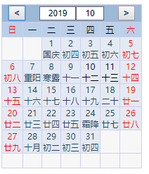

# 一个简单的响应式日历组件，[rv.js](https://github.com/yhongm/rv.js)实现

# 使用方法
npm install rvcalendar
```javascript


    import generateView from 'rvcalendar'
    window.onload = function () {
    generateView("#app", function (selectDay) {
        console.log("select,:"+selectDay)
    })
}
```
[DEMO](https://github.com/yhongm/rvCalendarDemo)
# 预览

